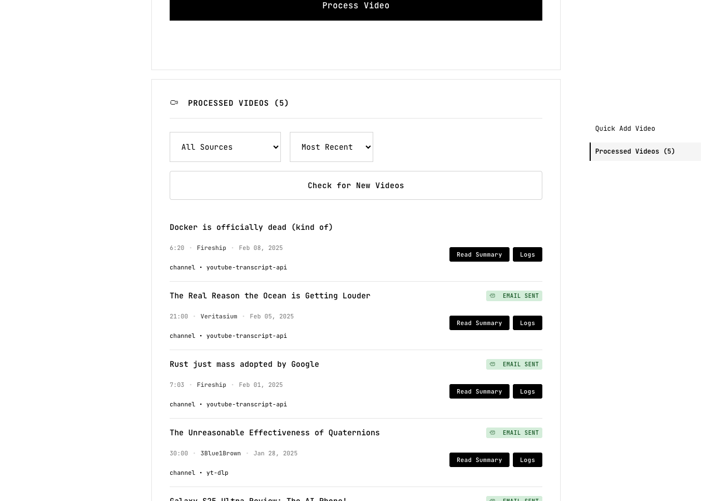
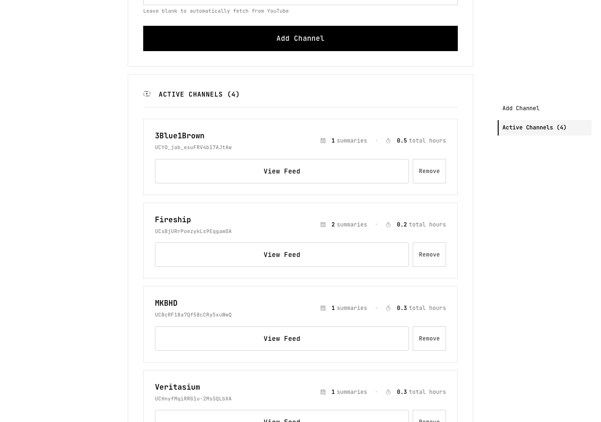
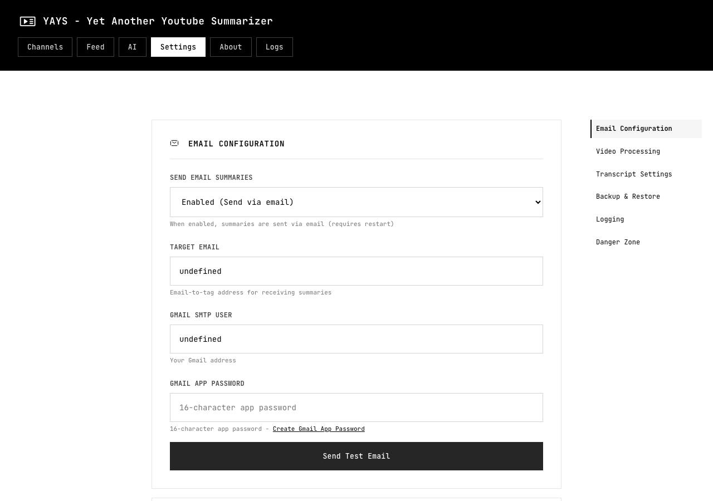
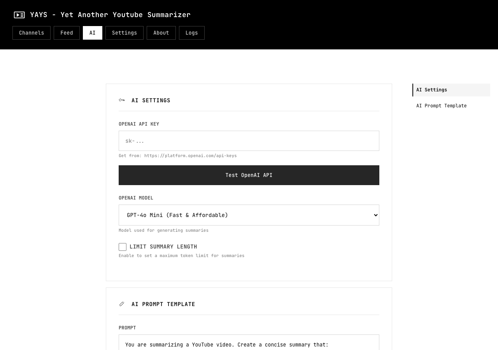

# YAYS — Yet Another YouTube Summarizer

**Because life's too short to watch every video.**

YAYS monitors your favorite YouTube channels, pulls transcripts, runs them through AI, and drops clean summaries straight into your inbox or RSS reader. Set it up once, forget about it.



**What you get:**
- 🤖 AI summaries via OpenAI (pick your model)
- 📧 Summaries land in your inbox or RSS reader automatically
- 📱 Clean web UI that works on your phone
- 🔄 Checks for new videos every 1–24 hours (you choose)
- 💾 Import/export your data
- 🚀 One-command install, one-command update



---

## Get Started

```bash
curl -fsSL https://raw.githubusercontent.com/icon3333/YAYS/main/install.sh | bash
cd ~/YAYS
docker compose up -d
```

Open http://localhost:8015, head to **Settings**, plug in your API key and email — done.



## Update

```bash
cd ~/YAYS && ./update.sh
```

Pulls code, rebuilds containers, restarts everything.

---

## Under the Hood

### Prerequisites

- [Docker & Docker Compose](https://get.docker.com)
- [OpenAI API key](https://platform.openai.com/api-keys)
- A target email address (inbox or RSS reader's email-in address)
- [Gmail app password](https://myaccount.google.com/security) for SMTP



### Transcript Extraction

YAYS tries four methods in order until one works:

1. **YouTube Transcript API** — fast, free, occasionally rate-limited
2. **yt-dlp subtitles** — slower but more reliable
3. **Direct Timedtext API** — scraping fallback
4. **Supadata.ai** — optional paid service, most reliable

The first three work out of the box. To enable Supadata: get a key at [supadata.ai](https://supadata.ai), then add it in Settings → Transcript Settings.

### Usage Details

**Adding channels:** Paste a YouTube channel URL in the input field and click Add Channel. Test with `UCddiUEpeqJcYeBxX1IVBKvQ` (The Verge).

**Single videos:** Go to Feed → Quick Add Video → paste a video URL. Processes immediately.

**Processing schedule:** Settings → Check Interval (default 4 hours, range 1–24). Changes take effect on the next cycle.

**Manual processing:**
```bash
docker exec youtube-summarizer python process_videos.py
```

### Credits

[FastAPI](https://fastapi.tiangolo.com/) · [OpenAI Python SDK](https://github.com/openai/openai-python) · [yt-dlp](https://github.com/yt-dlp/yt-dlp) · [youtube-transcript-api](https://github.com/jdepoix/youtube-transcript-api) · [Supadata.ai](https://supadata.ai) · [BeautifulSoup4](https://www.crummy.com/software/BeautifulSoup/) · [Docker](https://www.docker.com/)

### License

MIT — see [LICENSE](LICENSE).
